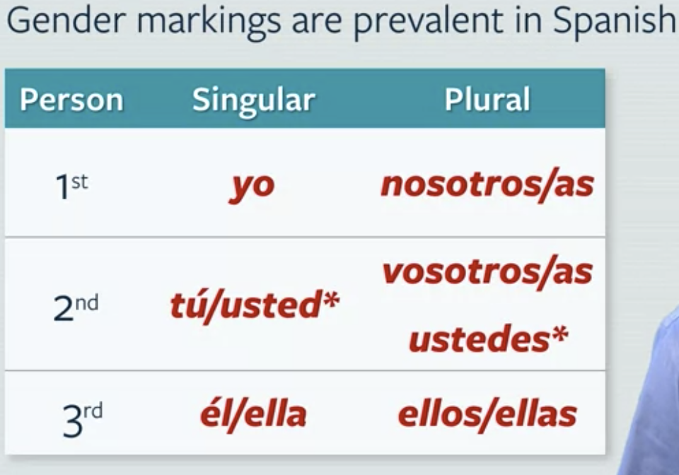
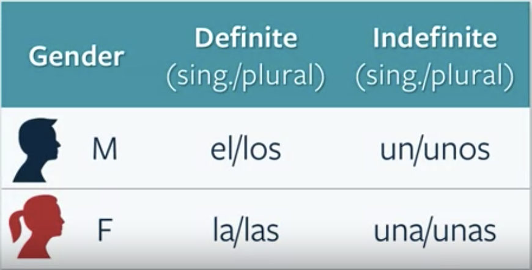
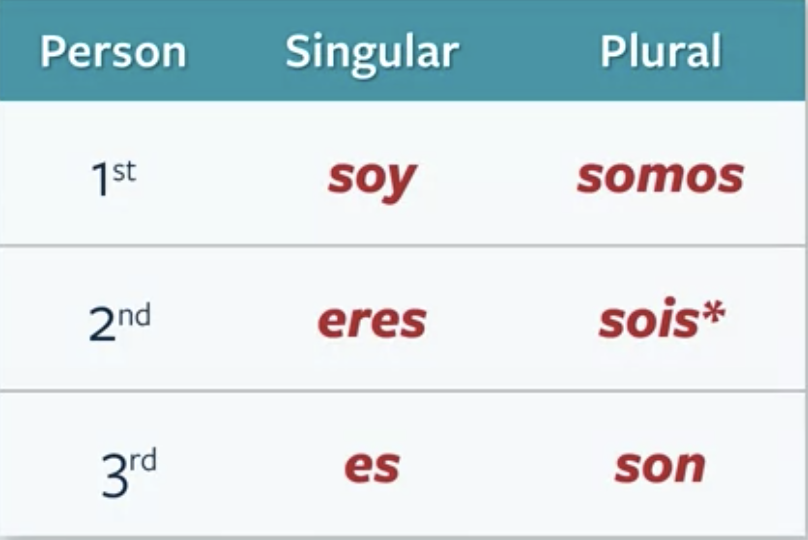
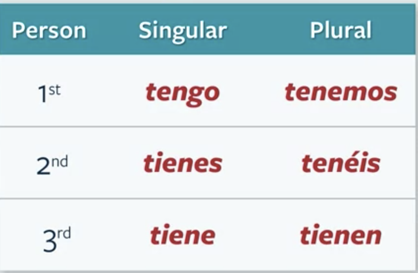
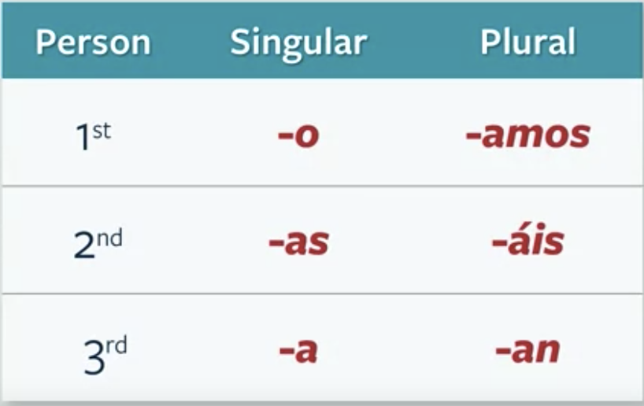
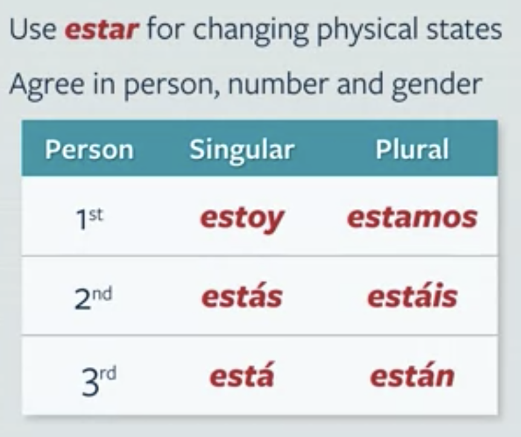
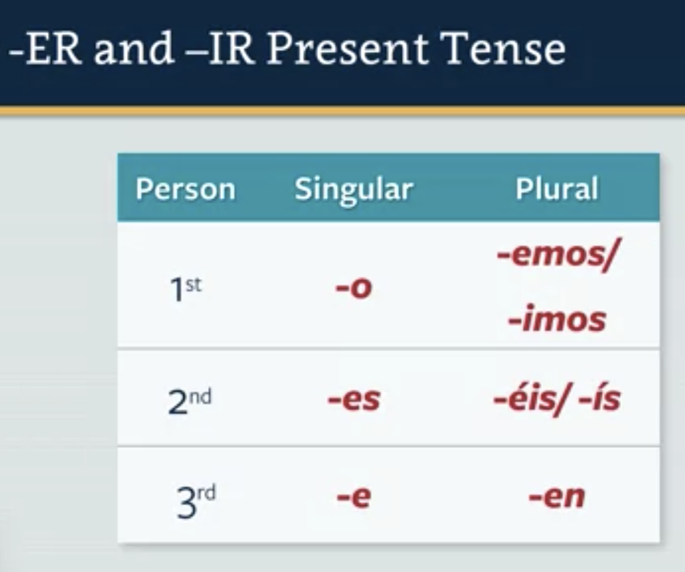

# Espanol introduction

Hola, me llamo Jinwei. Tengo 23 años. Recientemente me gradué del Imperial College de Londres. Ahora soy un profesional que trabaja para el banco de inversión. Comencé a aprender español después del final de mi universidad. Al principio, aprendo español solo porque quiero elegir un idioma ampliamente hablado para aprender. A medida que aumenta el tiempo de estudio, la historia de España y las personas me parecen muy interesantes. Espero seguir aprendiendo este idioma como mi hobbit personal. Gracias.
    
Hola! Me ____llamo___ Yolanda. Yo ___soy__ profesora de universidad. Yo tengo una familia grande. Mi esposo se ____llama____ Jorge. Él ___tiene______ una familia pequeña.. Los dos hijos nuestros _____tienen___ una buena relación con sus abuelos. Mi madre siempre dice “nosotros ____somos____ personas muy especiales porque todos _____tenemos___ mucha educación.”

Mi esposo _____es___ un hombre muy trabajador. La educación tiene mucha importancia porque mis padres ____son___ profesores de las ciencias. Mi esposo también _______trabaja___ (´works´) en la universidad. Nosotros ____pasamos____ todo el día en la clase. Mi madre siempre me dice “Con educación, hija, tú __tienes___ un futuro brillante.

Hola! Me llamo Yolanda. Yo soy profesora de universidad. Yo tengo una familia grande. Mi esposo se llama Jorge. Él tiene una familia pequeña.. Los dos hijos nuestros tienen una buena relación con sus abuelos. Mi madre siempre dice “nosotros somos personas muy especiales porque todos tenemos mucha educación.”

Mi esposo es un hombre muy trabajador. La educación tiene mucha importancia porque mis padres son profesores de las ciencias. Mi esposo también trabaja (´works´) en la universidad. Nosotros pasamos todo el día en la clase. Mi madre siempre me dice “Con educación, hija, tú tienes un futuro brillante.

update

# Greeting：

Hola	Hello  
Buenos días	Good morning  
Buenas tardes	Good afternoon  
Buenas noches	Good night  
 	 
Adiós	Goodbye  
Hasta luego	Until the next time  
Hasta la vista	Until the next time we see each other  
 	 
Mucho gusto. Nice to meet you.    
Por favor	Please  
Sí  yes.
Gracias	Thanks  
De nada	You're welcome  
Con permiso	Excuse me (coming through)  
Disculpe	Excuse me (I'm sorry)  
Disculpa	Excuse me (I'm sorry)  
Perdón	Excuse me (I'm sorry)  
Lo siento   I am sorry

Felicidades	Congratulations  
Buena suerte	Good luck  
 	 
Señor	Mr.  
Señora	Mrs.  
Señorita	Ms.  
 
¿Cómo estás?	How are you?  
¿Cómo está usted?	How are you? (formal)  
¿Qué tal?	How are you?   
bien	   good  
mal	   bad   

# Espanol words：

-  el niño 男孩
-  La niña (the girl)
- La mujer (the woman)
- el hombre (The man)
- Yo soy un niño (I am a boy)
- ¡vamos a ello (go for it)
- manzana (apple)
- la leche (milk)
- el agua (water)
- el pan (bread)
- bebe (drink)
- inglés (english)
- hablas (speak)
- español(Spanish)
- muchos (many)
- amigos (friend)

Non ended with -o masculine
Non ended with -a/-dad/-ción feminine 
Non ended with -e depends 
-s -es plural.

SUSTANTIVOS (nouns)  
Mano (f): hand(s)  
Agua (f): water  
Ojo (m): eye  
Cuerpo (m): body  
Voz (f): voice  
Cabeza (f): head  
Color (m): color  
Información (f): information  
Imagen (f): image  
Estilo (m): style, design  
Figura (f): figure, shape  
Cabello/pelo (m): hair  
Cara (f): face  
Calor (m): heat  
Frío (m): cold  
Sed (f): thirst  
Hambre (f): hunger  
Miedo (m): fear  
Dolor (m): pain  
Tos (f): cough  
Deporte (m): sport  
Dieta (f): diet  
Médico (m/f): doctor  
Medicina (f)/medicamento (m): medicine, drugs  
VERBOS  
Estar: to be  
Tener: to have  
Hacer: to do/to make  
Cumplir: to comply, to fulfill, to perform  
Usar: to use  
Llevar: to carry, to transport  
Llorar: to cry, to weep  
Ser: to be  
Deber: must  
Poder: to be able to  
Necesitar: to need to  
Comer: to eat  
Beber: to drink  
Correr: to run  
Recibir: to receive  
Escribir: to write  
Contagiar: to infect  
Esperar: to hope for, to expect, to wait  
Sudar: to sweat  
Tomar: to drink, to take  

ADJETIVOS (adjectives)  
Bien≠ mal/regular: (to be) good/bad or sick  
Regular: (to be) so so, just ok, not so good  
Pequeño/a: small, little  
Grande: great  
Bajo: short (height)  
Alto: tall  
Largo: long  
Corto/a: short (length)
Fuerte: strong  
Débil: weak  
Joven: young  
Viejo: old  
Rubio ≠ moreno: blonde ≠ brown-haired  
Rápido ≠ despacio: quickly ≠ slowly  
Enfermo: sick  
Resfriado: sick with a cold (not with the flu = la gripe)  
Molesto: annoyed, uncomfortable  
Irritado: irritated  
EXPRESIONES (expressions)  
Cómo: how  
Porque: because  
Ahora: now  
Después: after  

# Sound：
ll -> sounds like y . ->Me llamo Roberto->My name is Roberto   
v -> souns like b. ->vamos a ver ->we'll see   
j/g + i/e sounds like h(he).-> Jorge es gigante->Jorge is giant   
ñ -> sounds like ny. año,mañana->year,tomorrow   
h is scilent -> hijo (son )hablar (talk)   
   
a(R) e(ei) i o u(wu)   
Mi amigo es muy educado -> My friend is very polite   
   
r vs rr caro (expensive) vs carro  (car)   
pero (but) perro(dog)
para(to/for) parra (grap vine)

# Grammar

**Subject:**
I -> yo.   
We -> nosotros (men)/ nosotras (women)  
You -> tú(informal)/usted(formal)  
he - él  
She-> ella  
They->     
  

casa bonita -> casas bonitas -> pretty houses      
año pasado -> años pasados -> last year    
hombre trabajador -> hombres trabajadores-> hard working man    
mujer trabajadora -> mujeres trabajadoras -> hard working woman    

 **Gender the/a**   
     

 la casa bonita -> las casas bonitas -> the preety house     
 el año pasado -> los años pasados -> last year    
 una hombre trabajador -> unas hombres trabajadores-> a/some hard working man/men

 **(ser/ tobe)Linking none with other expression**    
     .       
 Usted and Ustedes go with the third person of verb    
 Usted es un hombre -> you are a man    
 Usteds son hombres -> You are men    
 Soy un hombree sincero -> I am a sincere man    
 Eres una mujer única y especial -> You are a unique and special woman     
 La hijia es muy inteligente ->  The daughter is very intelligente    
 Somos las hijia de la familia Nuñez. -> We are the daughters of the Nuñez family    
 Vosotras sois pequeñas -> you all are little     
 Los hombres son trabajadores.  -> the man are hard working workers      

 **Tener**    
      .       
Tengo una hermana. -> I have a sister     
¿Tienes hermanas? -> Do you have sisters?    
Tiene un hermano. -> He/She has a brother.     
Tenemos una casa pequeña. -> We have a small house. 
Tenéis unos padres trabajadores. -> You all have parents who are very hard working      

 **AR verbs**    
The following person and number endings are added to the root in order to form the present tense.   
      .    
 Hablo inglés y español, pero mis padres solo hablan inglés. -> I speak English and Spanish, but my parents only speak English.    

 **Numbers**       
Uno, dos, tres, cuatro, cinco, seis, siete, ocho, nueve, diez.     
¡Ya saben los números!

 **Perspectivas Introduction**

**Estar**   
      .    
  Yo estoy. Tú estás. Él está. Ella está. Usted está. Nosotros estamos. Vosotros estáis. Ellos están. Ustedes están.   
  Estoy regular. I'm feeling just so-so.    
  Estoy molesto por la comida picante. I don't feel so good because of the spicy food.     
  ¿Estás resfriado? Do you have a cold?     
  ¿Está usted enfermo? Are you sick? Using the formal form.     
  Mi compañera del piso está enferma. My roommate has a cold.     
  Los ojos están irritados. My eyes are irritated.     
  ¿Chicos, estáis contentos? Are y'all happy?     
  Remember that usted/ustedes is the formal 2nd-person subject pronoun.

**Tengo**
Tengo frío I am cold  
Tengo calor I am hot   
¿Tienes hambre? Are you hungary ?   
¿Tienes sed? Are you thirsty?   
Tiene fiebre He has fever.    
Tenemos tos  we have a cough    
Tienen dolor They are sore    

**-AR, -ER, -IR Regular Verbs**    
      .      
So let's review and take a look at the -AR verbs, with a verb such as preguntar to ask a question.     
Yo pregunto. Tú preguntas. Él pregunta. Nosotros preguntamos Vosotros preguntáis. Ellos preguntan   

Now let's look at an -ER and an -IR verb.     
An -ER Verb could be like the one, comer, to eat.    
And an -IR verb could be like vivir, to live.    
Yo como. Yo vivo. Tú comes. Tú vives. Él come. Él vive. Nosotros comemos. Nosotros vivimos. Vosotros coméis. Vosotros vivís. Ellos comen. Ellos viven.    

Como pan todos los días. I eat bread everyday.    
¿Comes pan con la comida? Do you eat bread with your food?    
Usted come mucho pan. You eat a lot of bread.    
Comemos mucho durante el dia. We eat a lot during the day.    
Ellos no comen nada. They hardly eat anything at all. 
Vivo en Davis.  I live in Davis.     
¿Vives en Davis? Do you live in Davis?     
Mi madre vive en Davis. My mother lives in Davis.    
Vivimos en California. We live in California.     
¿Vivís en California? Do you all live in California?    
Viven en California. They live in California    

# Number

1 - uno
2 - dos
3 - tres
4 - cuatro
5 - cinco
6 - seis
7 - siete
8 - ocho
9 - nueve
10 - diez
11 - once
12 - doce
13 - trece
14 - catorce
15 - quince
16 - dieciséis
17 - diecisiete
18 - dieciocho
19 - diecinueve
20 - veinte
21 - veintiuno
22 - veintidós
23 - veintitrés
24 - veinticuatro
25 - veinticinco
26 - veintiséis
27 - veintisiete
28 - veintiocho
29 - veintinueve
30 - treinta
31 - treinta y uno
32 - treinta y dos
33 - treinta y tres
40 - cuarenta
41 - cuarenta y uno
42 - cuarenta y dos
50 - cincuenta
60 - sesenta
70 - setenta
80 - ochenta
90 - noventa
100 - cien
101 - ciento uno
102 - ciento dos
110 - ciento diez
111 - ciento once
200 - doscientos
201 - doscientos uno
202 - doscientos dos
211 - doscientos once
276 - doscientos setenta y seis
300 - trescientos
400 - cuatrocientos
500 - quinientos
600 - seiscientos
700 - setecientos
800 - ochocientos
900 - novecientos
1.000 - mil
1.011 - mil once
1.111 - mil ciento once
2.000 - dos mil
3.000.003 - tres millones tres

 # tests:
 Soy un hombre sincero -> I am a sincere man     
 Eres una mujer única y especial -> you are unique and special woman      
 La hija es muy inteligente.    -> my daughter is very intelligent    
 Somos las hijia de la familia Nuñez -> we are the daughter of the Nuñez family.     
 Yo tengo unos hermanos trabajadores. Yo_/tener/uno/hermanos_/trabajador.     
Los padres son especiales. Los_/padre/ser/especial.   
Nosotros estudiamos la lengua española. Nosotros_/estudiar/el/lengua_/español.   
Las amigas son importantes. Las_/amigo/ser/importante.   

1.Question 1
How would you conjugate the verb estudiar in the following sentence?

Yo ______estudio_______ español con un profesor de Colombia.
estudias,estudia,estudio,estudian

2.Question 2
How would you conjugate the verb llamar in the following sentence?

Nosotros ______llamamos_______ con teléfono todas las noches.
llamamos,llama,llamo,llaman

3.Question 3
How would you conjugate the verb pasar in the following sentence?
¿ _________Pasa____ usted mucho tiempo en familia?
Pasas,Pasamos,Paso,Pasa

4.Question 4
How would you conjugate the verb preguntar in the following sentence?
Los estudiantes _____________ por la gramática.
preguntamos,pregunto,preguntan,preguntas,Incorrect

5.Question 5
How would you conjugate the verb ser in the following sentence?
Ustedes _____son________ colombianos, ¿no?
somos,es,eres,son,Correct

6.Question 6
How would you conjugate the verb tener in the following sentence?
Vosotros _____tenéis________ una familia muy educada.
tengo,tienes,tienen,tenéis

7.Question 7
How would you conjugate the verb ser in the following sentence?
Robert y Elena ______son_______ hermanos.
soy,eres,somos,son

8.Question 8
How would you conjugate the verb tener in the following sentence?
Yo ______tengo_______ una relación muy buena con mis abuelos.
tengo,tenemos,tienes,tienen

9.Question 9
Cuatro + Tres = siete
doce,cinco,uno,siete

10.Question 10
Ocho = cinco + tres

seis + uno,cuatro + seis,cuatro + siete,cinco + tres

11.Question 11
Lulu tiene dos años. Jorge tiene siete. Jorge es mayor.
Jorge es menor,Tienen la misma edad,Lulu es mayor,Jorge es mayor.

12.Question 12
Rafael tiene 22 años. Gabriela tiene 22 años. Tienen la misma edad.
Gabriela es mayor.Rafael es menor.Rafael es mayor.Tienen la misma edad.

¿De dónde es Lina?
¿Tiene Lina una familia grande o pequeña?

Although she was born in Colombia, and still has family there, she lives in California with her husband, and her daughter, Lucille, but Lulu, for short. Lulu looks a lot like her father, with blond hair and blue eyes. Her parents still live in Colombia, along with her older brother and sister. Lina is happy with her small family for now, [SOUND] probably it won’t grow too much bigger. Now that you know the basics of what she said, go ahead and watch Lina’s video again and see if you can pick out more of what she said, and then go ahead and complete the comprehension quiz. 

Ella ______tienes_______ muchos amigos.
La madre buena ---> __ ________ ____________?
José es trabajador. Él es padre. Tiene dos hijos, Ana y Marcos. ¿Cuántos hijos tiene José?
_______ son inteligentes.

Usted hace su trabajo bien.  
Rosana y Arón cumplen (fulfill) sus tareas (chores).    
Nosotros llevamos a los trabajadores a su trabajo.    
Ustedes deben hablar con su familia.

Week2:

Yo ____cumplo___ con las instrucciones del médico.

cumplo

cumples

cumplimos

cumplen

1 point

2.Question 2
How would you conjugate the verb comer in the following sentence?

Amiga mia, ¿___Comes____ de una forma saludable?

Come

Como

Comen

Comes

1 point

3.Question 3 ！！！！！！！！！
How would you conjugate the verb deber in the following sentence?

Ustedes ____deben___ tomar la medicina todos los días.

debemos

deben

debes

debo

1 point

4.Question 4
How would you conjugate the verb correr in the following sentence?

Los estudiantes ___corren____ mucho para el primer día de clase.

corre

corren

corro

corres

1 point

5.Question 5 ！！！！！！
How would you conjugate the verb escribir in the following sentence?

Ustedes _______ la tarea por computadora.

escriben

escribimos

escribe

escribo

1 point

6.Question 6
How would you conjugate the verb beber in the following sentence?

¿Y vosotros? ¿___Bebéis____ mucha agua?

Bebemos

Bebo

Bebéis

Beben

1 point

7.Question 7
How would you conjugate the verb necesitar in the following sentence?

Mi padre ___necesita____ tener cuidado con la salud.

necesitan

necesitamos

necesito

necesita

1 point

8.Question 8
How would you conjugate the verb tener in the following sentence?

Yo creo que ___tengo____ gripa con fiebre y todo.

tenemos

tengo

tiene

tienes

1 point

9.Question 9
How would you conjugate the verb llevar in the following sentence?

Nosotros ____llevamos___ a nuestro compañero al hospital.

lleva

llevamos

llevan

llevas

1 point

10.Question 10
42 + 34 = setenta y seis

setenta y seis

setenta y siete

ochenta y cinco

sesenta y seis

1 point

11.Question 11
No todo el mundo tiene cabello

cabeza

cara

cabello

cuerpo

1 point

12.Question 12 ！！！！！！！
Rafael no sale de su casa. No come en restaurantes. No toca nada en público. Tiene miedo  

Tiene gripe

Tiene miedo

Tiene frío

Tiene calor

1 point

Yo_/correr/para_/mantener/el/forma. Yo corro para mantener la forma.    

Miguel_/beber/un/taza_/de café_/por la mañana_.  Miguel bebe una taza de café por la mañana.   

Jorge y Rosa_/recibir/medicina_/de/su/médico_.Jorge y Rosa reciben medicina de su médico.   

Nosotros_/escribir/un/tarjeta_/a Juan_. Nosotros escribimos una tarjeta a Juan.   

Hoy yo _______ regular. Los ojos _______ y tengo muchos ________ por todo el cuerpo. Necesito tomar_________ y por eso tengo una visita con el __________ en una hora. En general, estoy muy _________. Por la noche ___________ mucho pero tengo ________ todo el tiempo y tengo una _______ horrible. Creo que estoy enfermo por el contacto con los amigos que están muy _________ . La comida me parece horrible ahora y no _______ nada--ni pan--porque no ________hambre.

Word List:
frío
estoy
resfriados
dolores
lloran
molesto
tengo
médico
sudo ('sweat')
tos
como
medicina

Hoy yo estoy regular. Los ojos lloran y tengo muchos dolores por todo el cuerpo. Necesito tomar medicina y por eso tengo una visita con el médico en una hora. En general, estoy muy molesto. Por la noche sudo mucho pero tengo frío todo el tiempo y tengo una tos horrible. Creo que estoy enfermo por el contacto con los amigos que están muy resfriados . La comida me parece horrible ahora y no como nada--ni pan--porque no tengo hambre.

Juan is having a tough day.    
He has a nasty cold coming on.    
He feels cold,    
his eyes are irritated and watering.   
He probably has a fever and,    
in general, he just feels uncomfortable and annoyed.    
He's going to see the doctor within the hour and expects that he'll get some medicine.    
He hopes it's not the flu, la gripe.     
He's probably picked up a viral infection from his roommate who likes to get a lot of hugs.      
In other words, está contagiado por ella. He's been infected by her.    
